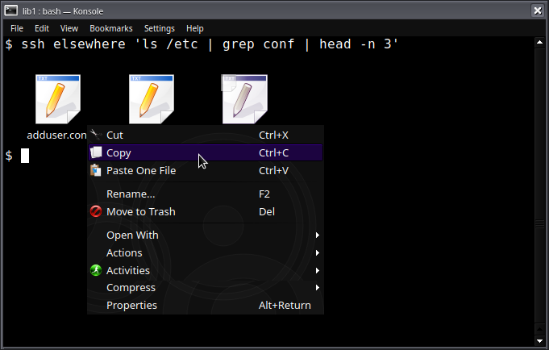

# `1` what?
Plain text can never form the basis of a real IDE. `1` threads annotated text through your pipes and to your terminal. Keep using your tools - make them sharper.

This project is still working on the proof-of-concept phase. There are many moving parts, and sometimes they blow up.

## Terms
"std" programs are all the existing ones. They read bytes from stdin, and write to stdout.
"atr" programs use `1`. They read packets from atrin, and write packets to atrout.

# What would this be good for?
The most useful thing is that your terminal can have plugins that let you interact with your programs in a fluent way.
It can also be used in pipelines.

Here's a mockup of the sort of thing a completed `1` environment could do:



## Syntax Highlighting
Syntax highlighting would no longer need to be your text editor's responsibility.
`diff` can have syntax highlighting, and so can `cat`, and so can `grep`.

## Inline Edit
`cat | grep` a file and fix a typo as you're reading it.

`cat *.c | sed "s/foo/bar/g" | reapply` to modify files from downstream in a pipe.

## Logging
If an atr program prints a message, you'll be able to jump to its source code in your text editor.

## Copy & Paste
Copying the most recently printed filename might be as quick as `^Y^F^M`.

## Vim errorformat
vim's errorformat is an awful `scanf`-style monstrosity. Here's the default value:

    %*[^"]"%f"%*\D%l: %m,"%f"%*\D%l: %m,%-G%f:%l: (Each undeclared identifier is
    reported only once,%-G%f:%l: for each function it appears in.), %-GIn file
    included from %f:%l:%c:,%-GIn file included from %f:%l:%c\,,%-GIn file
    included from %f:%l:%c,%-GIn file included from %f:%l,%-G%*[ ]from
    %f:%l:%c,%-G%*[ ]from %f:%l:,%-G%*[ ]from %f:%l\,,%-G%*[ ]from %f:%l,%f:%l
    :%c:%m,%f(%l):%m,%f:%l:%m,"%f"\, line %l%*\D%c%*[^ ] %m,%D%*\a[%*\d]: Entering
    directory %*[`']%f',%X%*\a[%*\d]: Leaving directory %*[`']%f',%D%*\a: Entering
    directory %*[`']%f',%X%*\a: Leaving directory %*[`']%f',%DMaking %*\a in %f,%f|%l| %m

You'll be able to use vim's quickfix with any program that prints line numbers, no matter what its format is - even brand new languages.
Your compiler can start emitting complex & useful error messages, like Rust does, without needing to worry about messing up people's lives.

## Commands as Objects
* Your terminal could timestamp every line of output as it receives it
* Your shell can make the command's runtime and exit status available, always, without being intrusive.
* Save a surprising long output after the fact without a hassle.
* Pipe the output of the last command into a new one without having to plan ahead.

## Output as Objects
* `ls | jq .`
* `jq … | xargs …`
* Print a table, filter it in-place

## Objects in Output
`ls -l` gives a nice table of stuff. What could we do with it?

    $ ls -l README.md
    -rw-rw-r-- 1 poseidon poseidon 8375 Jan  6 11:26 README.md

* Toggle RWX bits
* Look up information about a user or group
* Hover over the date to see the `ctime` with more time resolution.
* Rename a file inline
* Copy remote files

# `1`? How?
Every detail is totally up for grabs at this point.
Here's a snapshot of the stack when I writing this.
(Already it is out of date. I have determined that it can't readily be implemented via a kernel module.)

## Userspace Programs

```c
#include <1.h>

void main() {
    l1_printp(
            L1_PPUSH "0"
            L1_PFIELD_NAME "greeting"
            L1_PFIELD_TEXT "Hello, attributes!"
            L1_PPOP "0"
            L1_PFORMAT "\n");
}
```

If you run this in a std terminal, you get:

    $ ./hello
    Hello, attributes!

However, if run in an atr pipeline (which I've been writing as `⇃` rather than `|`), you get...

    $ ./hello ⇃ ./deatr
    $meta:emitter_source_file=hello.c$meta:emitter_line=13(0$greeting>Hello, attributes!)0-

(deatr reads attributes from atrin and writes them to stdout nicely formatted with colors.)

## The Wire Format

    struct l1_packet_header {
        u16 payload_len

        u8 header_len
        // Excludes the length fields.
        // So if you've just read header_len, the next packet starts at header_len + payload_len.
        // Punned as the packet format version.

        u8 flags = {
            L1_PF_STD_VISIBLE 0x1
            L1_PF_SYNTHETIC   0x2
            L1_PF_INCOMPLETE  0x4
        }

        u8 type = {
            L1_PUSH           '('
            L1_POP            ')'
            L1_FIELD_NAME     '$'
            L1_FIELD_TYPE     ':'
            L1_FIELD_VALUE    '='
            L1_FIELD_TEXT     '>'
            L1_FORMAT         '-'
            L1_COMMENT        '_'
            L1_LABEL          '*'
        }

        // payload follows
    };

I'm pretty happy with the general packet format,
but I've put zero thought into types & payloads.

## The Shell
Ideally you don't have to touch your shell. My current prototyping requires this; I believe this won't be a requirement.

## The Kernel
I have a kernel module.

The kernel module adds a device, `/dev/1`, which can be opened, and sent an `ioctl` to "wrap" the existing "naked" file.
Std processes read and write to the wrapped file device, which get converted into and out of packets.
The writes get wrapped with a generic "synthetic" header.
On the read end of the wrapped pipe, packets that don't have the `STD_VISIBLE` flag are skipped over.
`lib1` issues an "unwrap" `ioctl` to get the naked file.
Naked files remain visible in the process's file table.


I'm finding this scheme isn't sound, simply due to issues with `close`.
I need to modify the kernel's pipe implementation, so this will require booting a custom kernel.
(It will have a side benefit of greatly simplifying the userspace side of things.)

Also, I have absolutely no fucking idea what I'm doing. (labrador hacking on the linux kernel.JPEG)


## The Terminal
Unix sockets have a curious feature called "ancillary messages" (see `man 7 unix`).
It allows sending files over unix sockets.
So, the terminal creates a unix socket, and sends one end off to live with the shell it spawns, in an environment variable,
If stdout is a tty, an atr sends the end of a pipe to the terminal through the socket,
and writes to that instead. It's very nice & simple.

I've been working with Alacritty.

There ought to be some kind of plugin system, using `.so`'s so that any terminal can use them. Work has not yet begun on this.


# Uhm
## This will break shell scripts.
No it won't. Not breaking things is the whole point. If something behaves differently in a regular terminal, that's a bug.
Posix should be maintained, and existing behavior should be maintained.

## There'll still be bugs, which will still break shell scripts.
Maybe. `ls` is the only program I've tried porting so far; I've noticed it has very tricky output logic due to trying to be fast on 2 Mhz.
Hopefully it doesn't get any worst.
Stuff that happily calls eg `printf("%i %s", ...)` should be easy.

## If I wanted to, I could do [stuff like syntax highlighting the contents of the terminal] already, without 1
Yeah, but ya didn't.

And even if you did, it would be a fragile hack, and therefore upstream would never accept it,
and therefore nobody other than you would benefit from it, and therefore you couldn't benefit from other people's similar work.

# Why Not...?
The section is mostly to shoo off obnoxious linux kernel developers who are here to issue their standard — and make no mistake, it is very wise —
objection that The Thing You Are Trying To Do Would Be Better Done In Userspace.
Well, I'd love to do it in userspace! Do you think I *enjoy* hacking upon the kernel? Hell no! It's awful! I hate it! Your kernel SUCKS!
RIIR! At least GDB works on the eighty year old GNU code!

Ahem.

The properties required are quite universal. It must work for *all* programs, *anywhere*.
Maybe a mathematician could nicely model & explain wtf is going on here, but I wouldn't understand it.

## What is this jargon?
### What is bladder control?
Processes don't actually have any control over what they print out. Try `LD_DEBUG=all ls`. And look at the gunk in `~/.xsession-errors`.
All those libraries aren't going to suddenly start playing nice, even in atr programs.

Therefore, you can't impose any requirements on how stdio is used.

### What is pump priming?
Certain potential techniques require at least a single byte of std output to be made available.
This is unworkable because an infinite number of hidden atr packets may be produced before a std visible one is ready.

### What is starvation?
[FIXME: Mby wrong term]
[FIXME: I'm not sure, was this it?]

1. Suppose that `process1 | process2`.
2. `process2`: `read(stdin)` (it's a std program)
3. `process1`: `write(atrout, <15 gigabytes>)`
4. `process1`: `write(stdout, <hash of those 15 gigabytes>)`


## Why not do this in userspace?
Because it's [mathematically impossible](wikipedia:Two General's Problem). Consensus can't be reached without guaranteed message receipts —
to mutually understand we both speak atr, or that I speak atr but you speak std.
Trying to do this in userspace would result in something complicated, wrong, fragile, and/or insane. (fuse, flock, strace)

## Why not enable via a global environment variable?
Great for bootstrapping, but a std command can't know about an environment variable.

## Why not write escape codes into the pipe?
Because the other end can't be assumed to know how to handle escape codes, and would likely do something wrong.
Also, a std program might print them unwittingly.

## Why not add a switch `-1` to all programs to enable atr?
You mean like, cause a thousand years of "oops, I forgot to add the... *<up><home><right-right-right-right><space>-1<enter>* oh wait it's ls which already had a -1, so actually it's..."?

I would prefer not to.

## Why not have the shell decide, eg `$PATH_FOR_ATR_PROGRAMS`
Doesn't work with mixed programs like ssh or shell scripts.

## Why not write escape codes to the terminal, when `stdout` `isatty`?
Because more than one process can be writing at a time.
Also being able to distinguish who wrote what is a (useful property)[https://github.com/tene/weaver].
Additionally, the string written to the terminal is not necessarily what the terminal reads, because of "line discipline".
Best of all, `wall` exists. Writing escape sequences to the terminal is perilous to begin with; what if your program gets ^C'd?

## Why not get a signaling mechanism by the other process starting a read?
That can't be done in userspace in a way that isn't insane, convoluted, hacky, and incorrect.
(AFAIK. I haven't actually read every single man page.)

These typically require pump priming.

### Actually, if you send a file in an ancillary message over a `unix(7)` socket, it will be closed if it doesn't land.
Still requires pump priming because messages can't be empty because the socket would have to be stdin to get the `read()` from a std process.

## Why not `LD_PRELOAD`, or `strace`...?
Fragile and insane.

## Why not ask the kernel if the other process is trying to read?
AFAIK there's no way to do this. [TODO: eBPF? uring?]

## Why not add [some simple thing] to the kernel that isn't `1`-specific?
The goal of this line of questioning is to pursue a userspace-only solution:
if you're going to change the kernel, the results ought to be worthwhile.
If it's not directly targeting `1`, it's probably not sound, and `1` requires soundness.

## Why not store a second pair of pipes in an environment variable?
Couple problems with this.

Pipes don't have an infinitely large buffer, so you can't duplicate your data to both pipes.
If one pipe has a large amount of data that needs to be read before reaching some that can be written to the other,
the reading process would starve.

bladder control; pump priming


Should reading from one pipe drain the other? That would require touching the kernel.

### But the terminal is like two pipes!
This is much easier because the process already knows if the terminal is atr or not.
Starvation is not a concern.
Any atr-reader can read both pipes (the terminal is one), but a std one can't.
Misordering writes is not a concern because an atr-packet can be modeled as a wonky
terminal-escape-sequence-that-does-who-knows-what wormhole — this is not the case in a pipeline; order matters.


...oh. Hmm! Okay that's interesting.
wait fuck! Ahh! ahhh!

well anyways. Ahem.

I guess the concern is... If I write S's to stdout and A's to atrout

  ASA

should definitely come out as `ASA` and not `AAS` or `SAA`
but even if it's totally wrong is that even enough of a reason to reach for the kernel?

Mmm, I think `SAA` is reason enough.
    wait, no, but!
        that doesn't happen, because if you want to wrap attributes around something, you control it.

if a process forks but doesn't know about these pipes, trouble - but what about cloexec?
does require shell, but, 100% better shell than kernel
close stdpipe -> atrpipe remains open
    mmm but if both are std nobody cares
    if both are atr we win
    if one is atr we win


## What about counting how many characters, and...
Bladder control.

## Why not do what the Plan9 terminal does
Yeah, it's weird how running hundreds of regexes over every line output to your terminal isn't more popular.
(...IIUC how that thing works. Someone please tell me what I'm talking about.)
If people actually did that, it'd remove the primary value-add of `1`.

## Why not just use PowerShell, which already exists?
It's better to sharpen the tools you already use. This is brownfield work.
Regardless of PowerShell's available & utility in Unix-land, your distro doesn't install it by default.

## Why not have the reading process send a signal upstream on a bidirectional pipe?
Because the writing process can't distinguish between slow-but-atr and std.

## .... Okay fine, what do you want in the kernel?

A marker bit added to pipe buffers. The file descriptors for each pipe get a bit indicating which mode they are in.

On the write end, the bit is simply copied to the pages that get written. Pages with different bits set can't be coalesced.

`(bit on the pipe end, bit of the page in the buffer) = ...`

`(std, std)` - Read the page straight
`(std, atr)` - Start (or continue) parsing the packets. Filter out packets without the `STD_VISIBLE` bit set.
`(atr, std)` - Wrap the page in a packet.
`(atr, atr)` - Split the packet if it crosses pages in the buffer. (An incomplete packet may be written.)

The `std/atr` bit is set with an ioctl. Libraries should first dup the file descriptor, because bladder control.


## Why not a kernel module adding a new device node to wrap a pipe, rather than changing pipes?
1. Closing a wrapper calls `release`, which has no idea what the context is. To close the associated pipe, it would have to look at all files in all processes.
(If the pipe doesn't get closed, the reading end will never get an EOF)
        Right but uhm why not... let the wrapper own the file? No file until lib1 asks for it, at which point it can know to close it.
        That would probably mess things up but I am not a kernel expert. Like, accounting? Max open fds? Mysterious files apparently unowned by anyone? Sounds bad to me.
2. `fcntl(_, F_SETPIPE_SZ)` wouldn't work since modules can't change `fcntl`'s behavior.
3. It'd be a shame to touch both kernel & shell.
(I'm ignoring the fact that God isn't real and a module *could* do whatever; let's not toy with such deep insanity.)


(It'd be sort of a shame to have to touch both the kernel & the shell.)

## Why not module that copy & pastes the whole pipe system?
could be a good strat; would require editing shell, mby good way to avoid having to reboot for kernel


# Philosophical
## Invisible stuff is bad.
Invisibility is inherent to all data until it is made visible. X-ray vision for your terminal, just press a button?

## Imposing such sweeping changes on the ecosystem… that's just like systemd!
Yeeep. For users, the cognitive cost probably won't exceed a couple of manpages.

## I don't want this, and I won't be able to ignore it forever.
I hope by then attributes will have great value.

## The difficulty of establishing conventions for attributes. ("Ontology")
I think you should respect the seniority and popularity of other software by letting them establish conventions first.
`ls` is senior to `git`, so the `ls` maintainers get to choose the conventions for files.
`git`'s newer, but won the war over hearts and minds, so `svn` should follow `git`'s lead.

## The semantic web is BS
Data is useless if something doesn't use it.
Some possible failures:
1. Every consumer has its own markup; there are 30 different ways to specify a time.
2. Producers and consumers are all in tiny cliques
3. A bunch of annotating happens, but nothing uses it
4. A bunch of consumers happen, but they're actually worthless, ... so nobody wastes effort making producers
4. A bunch of consumers happen, but they're actually worthless, ... and effort is wasted trying to talk to them

## It's a lot of work
Mmhmm. But it's okay if uncommon software is left the way they are.
These capabilities haven't been done before (excepting `ls --url`) because it was too difficult, with only a single place to benefit.

## This isn't necessary
Are ya winnin', son?

### You speak in riddles!
You're not winning. Have you ever used a smartphone? They're awful, and it's our fault for not making Real Computing™ comprehensible to mere mortals.

## BSD, etc.
Another reason to keep behavior consistent. Will it enter POSIX?

## '1'? That's an awful name!
shut up its' a great name

(I mean, so is GNU. Bad names are traditional. If your identifiers can't start with/be numbers, use `lib1`.
For C namespacing, I've been using `l1\_`. You link the library with `-l1`, so this pleases me.)

The name was chosen for this reason: `find` has the `-0` switch. C strings are the avatar of the low-level awfulness, so why not do it 1 better?

It's obnoxious & audacious: what's not to love?

# Porting my program...?
## Languages and libraries?
C's got a reasonably good library (for C :P).
Rust's got a mediocre library.

## What are some ways for me to fuck things up?
* By introducing an inconsistency in output: `atr/my-program | atr/cat | std/cat` should be the same as `atr/my-program | std/cat` should be the same as `std/my-program`, for all invocations of `my-program`.
* By acting half-way between a std program and an atr program. Ignore it or embrace it.
* By making up your own ontology. Patience!

# </FAQ>. Some other things.
## CLI Sharpening
Running `some\_program --help` should teach your terminal/shell how to tab-complete it by printing completion info in a hidden attribute.
Intellisense for bash?

(Someone is working on generating tab completions from a JSON file; but I forget who...)

Can the shell be made accessible to the masses?

[FIXME: How is the shell supposed to actually see this data? Capturing stdout if there's a `--help` seems bad. Maybe there's a shell builtin, `study my-command --help`]

## The Web
If you don't find the open web to be offensive & bad, you must be new here.

Explore the 1nternet with `netcat`!

## Emacs
(Note: I don't use emacs, nor do I know it very well.)

I would like for terminals to become sophisticated enough for their GUI frontend to no longer be needed.

`ls --dired` would no longer need to be a thing, and any program could serve just as well.

Some people want non-monospace text. It would be difficult.

## Curses
It's not very important, but… escape codes are kind of an ugly mess.
They could stand to be rationalized by using attributes instead.
This would be an opportunity to provide the sorts of events that a GUI program receives.

# Incompatibility Chart

+-----+-----------------------------------------------------+
| `P` | Posix incompatibility                               |
| `E` | Previously eronneous behavior becomes functional    |
| `I` | Incompatibility with existing system implementation |
| `?` | Undecided implementation detail                     |
+-----+-----------------------------------------------------+


* (?) New behavior depending on environment variables
* (?) std programs might change their behavior if the environment variables used by 1 are present, even if 1 isn't actually in use on the system.
* (E) New behavior depending on arguments
* (PI) Echo might get new behavior depending on arguments?
* (PI) The shell might create a non-pipe between processes. This could break pipe-specific fcntl/ioctl
* (PI) A process might wait for ancillary data (Is CMSG even posix? Yes, or nearly.), despite it supposed to be being a pipe.
* (E) A script could expect a command to error. This problem isn't 1-specific.
* (?E) A process might depend on the ioctls used by 1 to error.
* (PI) The number of syscalls is, unavoidably, going to change. This could mess up some notion atomic writes.
* some kind of weird interlocking pipeline where a command later causes an earlier command to do something...?
* (?P) std-polling must do something if there is an atr packet.
    * Ignore it: the std process might never start reading -- Ah! No! This is fine! Select is as good as a read for signalling purposes.
    * Signal on it: the std process will get a spurious wakeup. This is fine for epoll because it specifies that it can happen, but it might be bad for select().

# Other Work
Arcan?
[I know there's at least 2 other projects more similar to this one, but I forget their names.]
